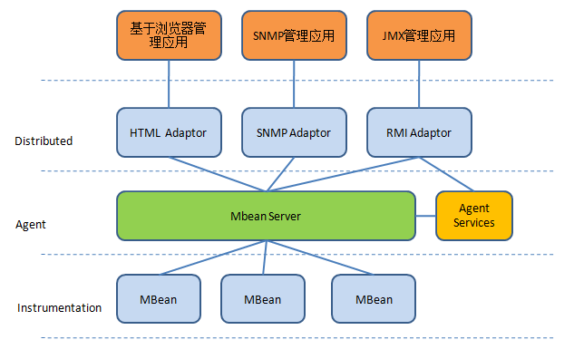
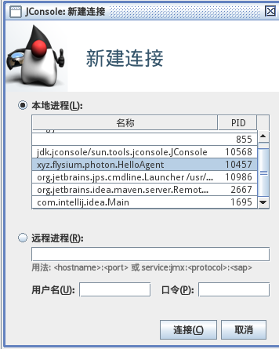
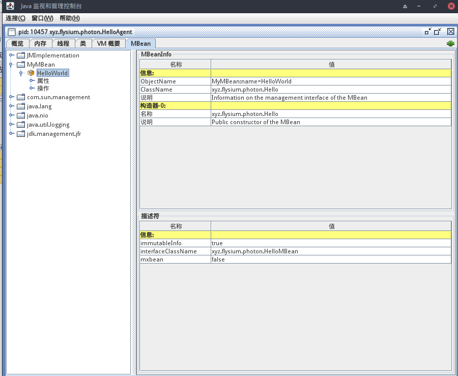
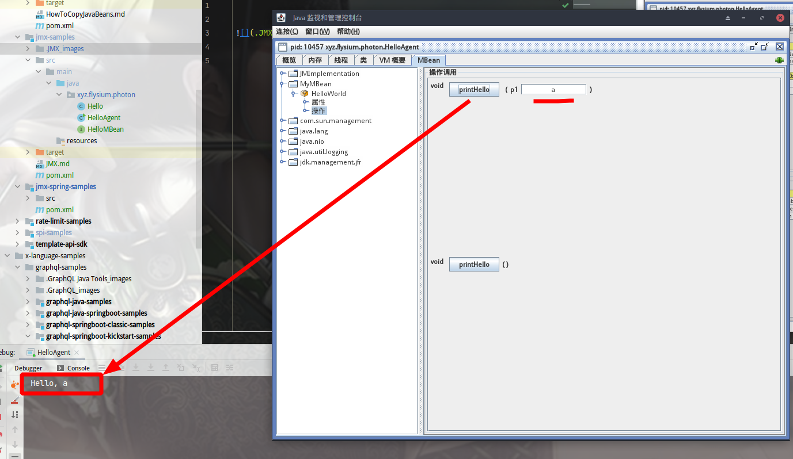
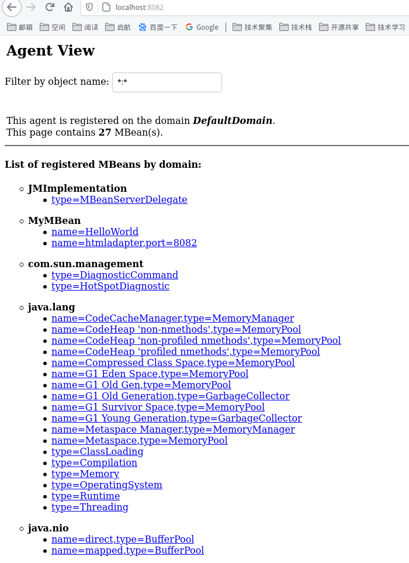

# JMX
`JMX`的全称为`Java Management Extensions`. 顾名思义，是管理Java的一种扩展。这种机制可以方便的管理、监控正在运行中的Java程序。常用于管理线程，内存，日志Level，服务重启，系统环境等。

## 基本术语
- `MBean`：是`Managed Bean`的简称，可以翻译为“管理构件”。
在`JMX`中`MBean`代表一个被管理的资源实例，通过`MBean`中暴露的方法和属性，外界可以获取被管理的资源的状态和操纵MBean的行为。事实上，`MBean`就是一个Java Object，同JavaBean模型一样，外界使用自醒和反射来获取Object的值和调用Object的方法，只是`MBean`更为复杂和高级一些。`MBean`通过公共方法以及遵从特定的设计模式封装了属性和操作，以便暴露给管理应用程序。例如，一个只读属性在管理构件中只有Get方法，既有Get又有Set方法表示是一个可读写的属性。一共有四种类型的MBean: `Standard MBean`, `Dynamic MBean`, `Open MBean`, `Model MBean`。

- `MBeanServer`：`MBean`生存在一个`MBeanServer`中。`MBeanServer`管理这些`MBean`，并且代理外界对它们的访问。并且`MBeanServer`提供了一种注册机制，是的外界可以通过名字来得到相应的MBean实例。

- `JMX Agent`：Agent只是一个Java进程，它包括这个`MBeanServer`和一系列附加的`MbeanService`。当然这些Service也是通过MBean的形式来发布。

- `Protocol Adapters and Connectors`：`MBeanServer`依赖于`Protocol Adapters`和`Connectors`来和运行该代理的Java虚拟机之外的管理应用程序进行通信。Protocol Adapters通过特定的协议提供了一张注册在MBeanServer的MBean的视图。例如，一个HTML Adapter可以将所有注册过的MBean显示在Web 页面上。不同的协议，提供不同的视图。Connectors还必须提供管理应用一方的接口以使代理和管理应用程序进行通信，即针对不同的协议，Connectors必须提供同样的远程接口来封装通信过程。当远程应用程序使用这个接口时，就可以通过网络透明的和代理进行交互，而忽略协议本身。Adapters和Connectors使MBean服务器与管理应用程序能进行通信。因此，一个代理要被管理，它必须提供至少一个Protocol Adapter或者Connector。面临多种管理应用时，代理可以包含各种不同的Protocol Adapters和Connectors。
当前已经实现和将要实现的Protocol Adapters和Connectors包括： `RMI Connector`, `SNMP Adapter`, `IIOP Adapter`, `HTML Adapter`, `HTTP Connector`.

## 基本构架


JMX分为三层，分别负责处理不同的事务。它们分别是：

- `Instrumentation` 层
    `Instrumentation`层主要包括了一系列的接口定义和描述如何开发MBean的规范。通常JMX所管理的资源有一个或多个**`MBean`**组成，因此这个资源可以是任何由Java语言开发的组件，或是一个`JavaWrapper`包装的其他语言开发的资源。

- `Agent` 层
    `Agent` 用来管理相应的资源，并且为远端用户提供访问的接口。Agent层构建在`Instrumentation`层之上，并且使用并管理 `Instrumentation`层内部描述的组件。Agent层主要定义了各种服务以及通信模型。该层的核心是一**`MBeanServer`**,所有的`MBean`都要向它注册，才能被管理。注册在`MBeanServer`上的`MBean`并不直接和远程应用程序进行通信，他们通过协议适配器（`Adapter`）和连接器（`Connector`）进行通信。通常`Agent`由一个`MBeanServer`和多个系统服务组成。JMX Agent并不关心它所管理的资源是什么。
    
- `Distributed` 层
    `Distributed`层关心Agent如何被远端用户访问的细节。它定义了一系列用来访问Agent的接口和组件，包括**`Adapter`**和**`Connector`**的描述。

如果一个Java对象可以由一个遵循JMX规范的管理器应用管理，那么这个Java对象就可以由JMX管理资源。要使一个Java对象可管理，则必须创建相应的`MBean`对象，并通过这些MBean对象管理相应的Java对象。当拥有MBean类后，需要将其实例化并注册到`MBeanServer`上。

## 服务端
步骤：
-  编写 `MBean`, 如 `xyz.flysium.photon.mbean.HelloMBean`， `xyz.flysium.photon.mbean.Hello`
-  编写 `Agent` 来创建`MBeanServer`，并注册，最后暴露 `RMI` 端口, 如 `xyz.flysium.photon.HelloAgent`

## 客户端
### JConsole
打开`JConsole`工具，如图在远程进程中输入`RMI`地址 `service:jmx:rmi:///jndi/rmi://localhost:1099/MyMBean`:


点击“连接”之后就出现：


接下来我们就可以操作 `MBean` 了：


### HTTP （可选）

以下需要 `jmxri.jar`, `jmxtools.jar`, `jmxremote.jar`: 

```java
public class HelloAgent {

  public static void main(String[] args) throws MalformedObjectNameException,
      NotCompliantMBeanException, InstanceAlreadyExistsException,
      MBeanRegistrationException, IOException {
  // ...

 ObjectName adapterName = new ObjectName(domainName + ":name=htmladapter,port=8082");
    HtmlAdaptorServer adapter = new HtmlAdaptorServer();
    adapter.start();
    mbs.registerMBean(adapter, adapterName);

  // ...
  }
}
```


### Java Client
我们不仅可以通过`JConsole`作为客户端采用rmi的方式来进行管理，我们同样可以采用自定义程序作为客户端来连接`JMXConnectorServer`管理`MBean`.

参考 `xyz.flysium.photon.Client`

