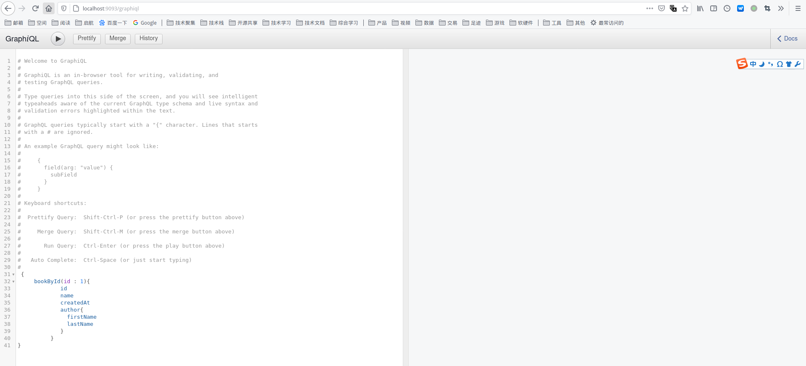
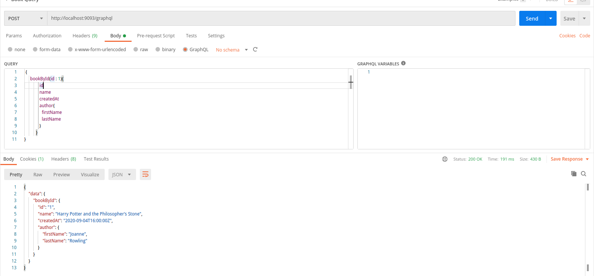

# GraphQL Java Tools ( Kickstart )

- https://www.graphql-java-kickstart.com/tools/


## 服务开发

主要开发 `revsolver`

## 测试接口

### 方式一：GraphiQL

```sh
http://localhost:9093/graphiql
```



### 方式二：Postman

```http request
POST http://localhost:9093/graphql
```

body 选择 `GraphQL`: 




### 方式三：单元测试

参考 `src/test/main`