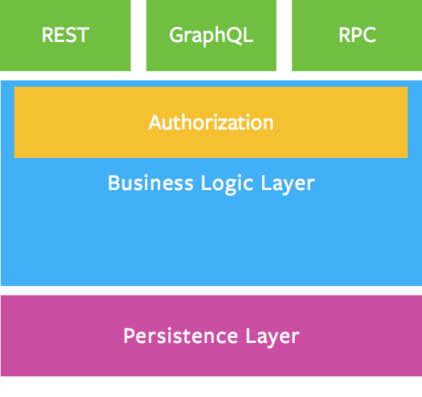

# GrapQL
- http://graphql.org/
- https://graphql.cn/

GraphQL 是 Fackbook 的一个开源项目，它定义了一种查询语言，用于描述客户端与服务端交互时的数据模型和功能，相比 RESTful API 主要有以下特点：
* 根据需要返回数据
* 一个请求获取多个资源
* 提供内省系统

这使得客户端的功能得到了加强，特别是在查询数据方面。

- https://graphql.cn/learn/thinking-in-graphs/

## start 
- https://aotu.io/notes/2017/12/15/graphql-use/index.html

## 学习和规范
- https://graphql.cn/learn/
- https://spec.graphql.cn

## 概念一览
- Schema: 指一个特定GraphQL类型系统的定义，也指具体的包含类型系统定义的文本文件。在类型定义中，schema {...} 这样的代码块定义的是入口类型，入口类型有三种，即查询，变更和订阅。值得说明的是，查询，变更和订阅也都是普通的类型而已，和其它对象类型语法上没有任何区别，只不过它们作为入口类型被定义在schema代码块中。
- 查询(query)：定义为入口的对象类型；和变更、订阅语法上并无不同，不过语义上对应的是读操作。
- 变更(mutation): 定义和语法同上，但语义上对应增/删/改操作。
- 订阅(subscription): 定义和语法同上，语义上对应的是一个订阅操作以及随后服务器对客户端的0~N次主动推送操作。
- 内省（introspection）: 可以通过特殊的graphql查询获取到整个类型系统的详细定义。这可能带来数据模型过度暴露的问题，以后会专门说明。
- 类型(type): 没什么好说，就是对象类型，和标量类型相对应。
- 标量(scalar): 非对象的简单数据类型，比如内置的String, Int, ID等。可以自己定义新的标量类型，只要为它编写序列化/反序列化方法即可，具体在graphql-java中对应的类是Coercing。
- 字段(field): 对象类型的成员，可以是对象类型或者标量类型。和java类里的field不同的是，GraphQL的field都是可以有参数的，因此有参数的field也可以理解成java中有特定类型返回值的方法。
- 接口(interface): 和java里的接口差不多，定义类型的公共字段，java实现中可以直接对应写一个interface。有点麻烦的是在每个interface的实现类中都必须重复书写公共字段。
- 联合(union): 和接口类似，但是不要求任何公共字段。为了方便可以在java实现中使用无方法的interface实现。
- 片段(fragment): 这是个查询时的概念，和schema定义无关，用于预定义类型上的若干个字段组合，后面的查询语句中可以反复引用，可避免重复书写这些字段组合。
- 内联片段(inline fragment)：片段还只是个简化查询的可有可无的东西，但内联片段则更重要，对于返回interface或union类型的字段，需要使用内联片段来根据结果的实际类型获取不同的字段。
- 别名(alias): 在查询中可为特定字段的查询增加别名，用来在返回的结果中加以区分，比如一次查询了两个特定用户，因为类型相同，字段也相同，如果不用别名，则无法在结果中区分彼此。
- 类型扩展(extend): 在schema中，可以使用extend给任意类型（包括interface/union）增加字段；这看似自找麻烦的机制实际上有很大用处，可以把高权限角色的特定字段使用extend写在另外的schema文件中，运行时可合并解析，不同角色的用户使用不同的schema。这样可以通过加法来控制类型系统的可见性，避免内省机制过度暴露类型系统。
- DataLoader: 用于批量查询。
- Relay: Facebook的另一个框架，应该是基于GraphQL的，解决一些更高层的实际应用问题，比如通用的分页机制等。

