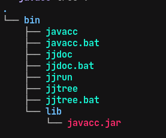

### 下载
* https://javacc.github.io/javacc/#download

并复制 scripts 和 target 的内容，构建为如下的结构：



加入 PATH

### 示例
Person.jj
```jj
options {
  STATIC = false;
}

PARSER_BEGIN(Person)
import java.io.*;

class Person {
 static public void main (String[] args) {
  for (String arg : args) {
   try {
    System.out.println(evaluate(arg));
   }
   catch (ParseException ex) {
    System.err.println(ex.getMessage());
   }
  }
 }

 static public long evaluate (String src) throws ParseException {
  Reader reader = new StringReader(src);
  return new Person(reader).expr();
 }
}
PARSER_END(Person)

SKIP: { < [" ","\t","\r","\n"] > }

TOKEN: {
 <INTEGER: (["0"-"9"])+>
}

long expr():

{
 Token x,y;
}
{
 x=<INTEGER> "+" y=<INTEGER> <EOF>
 {
   return Long.parseLong(x.image) + Long.parseLong(y.image);
 }
}
```

### JavaCC 编译
```shell
javacc Person.jj
```

生成 Person.java 及其他java文件

### JavaC 编译
```shell
javac Person.java
```

### 测试
```shell
java Person 1+9
```

